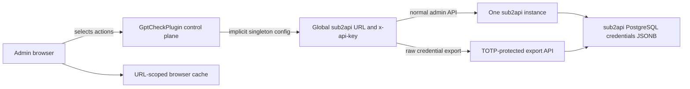
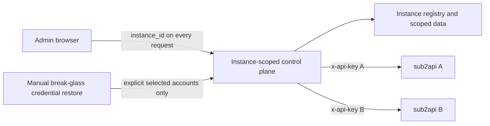
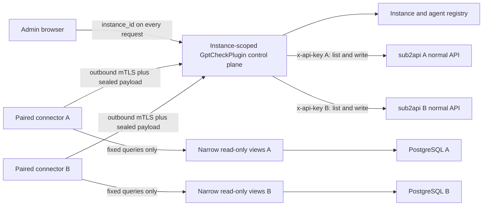
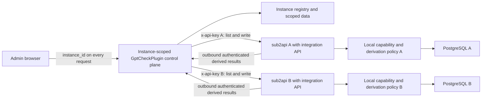

# Security Hardening Proposal: Instance-Scoped Management And Sensitive Credential Access

## Decision

We need to decide how GptCheckPlugin can manage several sub2api instances and
recover the information hidden behind sub2api's step-up authentication without
weakening that protection. The decision has two inseparable parts: every normal
operation must become instance-scoped, and any new credential path must have
less authority than the current TOTP-protected bulk export.

This document is a design proposal, not an implementation claim. No application
source or x1/x2 deployment was changed while preparing it.

## Executive Recommendation

We have three serious options:

1. **API-only with manual break-glass restore.** Add real multi-instance
   isolation, keep normal operations on each instance's x-api-key, and require
   explicit manual restoration when sensitive data is missing.
2. **Paired read-only connector.** Add the same instance isolation, then install
   one lightweight outbound connector beside each selected sub2api. Give it
   fixed, narrow database views and return derived OAuth metadata by default.
3. **sub2api-owned integration boundary.** Add a capability-scoped internal API
   or outbound integration worker inside sub2api so no external process reads
   its credential tables directly.

I recommend Option 2 under the current constraints. It is compatible with an
unmodified sub2api runtime and can be rolled out one instance at a time. The
recommendation is conditional: if we can maintain or upstream a small sub2api
integration module, Option 3 becomes the stronger long-term boundary. Option 1
should remain the operational fallback in either case.

## Evidence

I inspected the current singleton configuration, client fallbacks, database
uniqueness constraints, schedulers, credential-import path, browser cache, and
local secret encryption. The global identity constraints in E03 and the live
credential storage observed in E07 most strongly shape this proposal: a UI
selector alone would cross-wire instances, while a database connector becomes
a high-value secret reader even when it cannot write.

| Evidence | Finding or document | What it establishes |
| --- | --- | --- |
| `E01` | Global runtime configuration | `runtime_config.py` owns one effective URL and x-api-key. |
| `E02` | Implicit singleton sub2api client | Many operations resolve the global configuration, including the raw API Key export path. |
| `E03` | Globally unique account identities | Email, sub2api account ID, and upstream URL are not scoped to an instance. |
| `E04` | Global background synchronization | Inventory and upstream work loops have no per-instance ownership. |
| `E05` | Singleton UI and URL cache | Settings, loading, and cache selection assume one active endpoint. |
| `E06` | Single local Fernet key | Current at-rest encryption is useful locally but is not a device identity or transport protocol. |
| `E07` | x2 raw JSONB credential storage | A database reader can see raw API Key, AT, RT, and ID token fields available to its role. |
| `E08` | sub2api version/schema drift | Inspected source and runtime versions differ, requiring fail-closed adapters. |
| `E09` | Local authenticated-envelope probe | Eight protocol checks passed; cryptographic processing was small relative to network and database work. |
| `E10` | Local PostgreSQL least-privilege probe | Narrow views allowed required synthetic reads while base-table reads and mutations were denied. |

The complete identities and limitations are recorded in
[`context.md`](../context.md).

## Current Design And Failure Mode

**Observed:** `EffectiveSub2ApiConfig` resolves a single URL and token from the
global `app_settings` table. `Sub2ApiClient` methods commonly fetch that value
inside the operation rather than accepting an immutable instance context. The
frontend similarly reads one settings object and partitions its upstream cache
by URL. Several central database keys are globally unique, including
`AccountSnapshot.email`, `UpstreamAccountConfig.sub2api_account_id`, and
`UpstreamChannel.canonical_base_url` (E01-E05).

**Observed:** the raw API Key synchronization path ultimately calls sub2api's
bulk data export. That endpoint now requires a TOTP-verified administrator
session, while ordinary account APIs continue to accept x-api-key. OAuth list
and detail responses redact raw AT/RT values. On x2, the backing JSONB contains
raw credential fields (E02, E07).

**Inferred:** adding a list of URLs to settings and switching a global current
URL would be unsafe. Two instances can both contain account `1` or the same
email. A delayed browser request or background job could then update the wrong
row, cache, or remote account. The selected instance must therefore be request
context, not mutable process state.

**Inferred:** direct database access does not bypass the need for a security
decision. It creates a second privileged export path. A read-only role protects
database integrity, but any process holding that role can exfiltrate every raw
secret the role can select. The connector must consequently minimize columns,
operations, rows per request, retention, and data returned to x1.

The current trust and authority flow is shown below. The diagram deliberately
separates the normal admin API from the step-up export because preserving that
distinction is central to the redesign.

[Mermaid source](../diagrams/multi-instance-sensitive-boundary-before.mmd)

The structural problem is not the 403 response itself. That response is the
expected enforcement point. The problem is that the plugin previously depended
on a bulk-secret capability for synchronization and has no separately scoped
provider for the small amount of sensitive information it actually needs.

## Desired Invariants

- Every instance-owned database row, API route, service call, background job,
  cache entry, log event, and browser response is bound to one immutable
  `instance_id`.
- A remote secret is never selected or written using `sub2api_account_id` alone;
  identity binding also covers instance, remote identity fingerprint, and a
  normalized source URL hash.
- Lists, renames, enable/disable changes, refresh requests, priorities, and
  other ordinary operations continue through that instance's x-api-key.
- TOTP seeds, administrator browser sessions, and long-lived administrator JWTs
  are never stored by GptCheckPlugin or a connector.
- OAuth AT/RT values do not reach the browser. By default, AT stays beside
  sub2api and the connector returns only subscription/entitlement metadata;
  raw RT export is not a normal capability.
- Raw API Keys stay beside sub2api whenever local upstream inspection can
  produce the required group/rate result. Any compatibility export is explicit,
  account-limited, encrypted to x1, and never logged.
- A connector has no arbitrary SQL, file-read, command-execution, URL-fetch, or
  Docker-control operation. Unknown schema or protocol versions fail closed.
- Every connector has an independently generated, rotatable, and revocable
  identity. Replayed, expired, cross-instance, or modified messages are rejected.
- Connector compromise cannot modify sub2api data. It may still expose fields
  visible through its narrow views; that residual confidentiality risk remains
  explicit and monitored.

## Constraints And Non-Goals

- Existing single-instance installations need a migration that preserves their
  encrypted data and makes the current instance the default.
- The current central database is SQLite with hand-written migrations. Replacing
  global unique constraints requires table rebuilds or adoption of a versioned
  migration tool; adding nullable columns alone is insufficient.
- The connector should be a small non-root process with no browser or inbound
  HTTP server. We assume a balanced security/operability profile because no
  production resource budget was supplied.
- The design must tolerate connector downtime without routing work to another
  instance. Normal x-api-key operations should remain available where possible.
- Automatic discovery is not a license to mount `/var/run/docker.sock`, scan the
  whole filesystem, or reuse sub2api's database administrator password. A
  one-time installer may inspect explicit local candidates, but an administrator
  confirms the DSN and provisions the narrow role.
- This proposal does not change sub2api's TOTP policy, expose secrets to frontend
  code, or promise that a JWT `exp` claim equals subscription expiry. Entitlement
  or account-check metadata remains the preferred subscription source.

## Before Architecture

The before view has one ambient connection configuration and one bulk export
dependency. Identity is implicit: account IDs, emails, scheduler state, and the
browser's current URL all stand in for a real instance boundary. This keeps the
single-instance implementation compact, but it cannot safely support concurrent
instances or a second secret provider.

The source diagram is
[`multi-instance-sensitive-boundary-before.mmd`](../diagrams/multi-instance-sensitive-boundary-before.mmd).
Its important edge is `Control -> Global`: the caller often does not carry the
target identity all the way to the network operation.

## Options

### Option 1: API-Only With Manual Break-Glass Restore

Option 1 completes the multi-instance data and request model but introduces no
resident secret reader. Each instance stores its own encrypted x-api-key, and
the control plane uses an immutable `InstanceContext` for all normal operations.
Sensitive values that sub2api refuses to expose remain unavailable until an
administrator performs an explicit, audited, account-scoped restore.

This is the strongest case for a small change surface. It preserves sub2api's
security model, adds no database principal, and adds no device lifecycle. It is
also the cleanest rollback target for later options. The cost is functional:
new or rotated API Keys cannot be imported automatically through the current
export path, and OAuth subscription metadata remains incomplete when the normal
API does not expose enough information.

We could make the manual path less dangerous by accepting only a small selected
set, checking instance plus remote identity fingerprints before storing a Key,
and immediately encrypting it with a versioned central at-rest key. Manual input
must not become a disguised bulk JSON upload or a way to paste administrator
sessions. OAuth RT should remain unsupported in this path.

Rollout is straightforward: migrate existing rows into a default instance,
make routes and workers instance-scoped, then add the selector. Rollback can
disable additional instances while preserving the default instance record.
Removing `instance_id` columns should not be part of rollback because doing so
would reintroduce identity ambiguity.

[Mermaid source](../diagrams/multi-instance-sensitive-boundary-api-only-after.mmd)

| Change | Before | After | Security consequence | Cost |
| --- | --- | --- | --- | --- |
| Instance identity | Global current URL | Immutable request/job `instance_id` | Prevents cross-instance confused-deputy actions | Broad schema and service migration |
| Sensitive access | TOTP bulk export dependency | No automated export | No new resident secret reader | Missing automatic Key/metadata recovery |
| Failure mode | 403 interrupts sync | Explicit unavailable/manual state | Predictable fail-closed behavior | More operator intervention |

The design meaningfully fixes multi-instance isolation, but it does not satisfy
the requested automatic recovery workflow. It remains valuable as the safe
fallback and as the first migration milestone.

### Option 2: Paired Read-Only Connector

Option 2 builds on the same instance-scoped control plane and installs one
connector beside each participating sub2api. The connector initiates an outbound
TLS 1.3 connection to x1; it exposes no listening port. Normal reads and writes
still go directly from x1 to the selected sub2api with that instance's
x-api-key. Only a separate `SensitiveCredentialProvider` can ask the connector
for fixed sensitive operations.

The provider should be capability-shaped rather than table-shaped. A reasonable
surface is `inspect_oauth_metadata(account_ids)` and
`inspect_api_key_upstreams(account_ids)`. The OAuth operation reads AT locally,
derives or queries entitlement metadata locally, and returns plan, subscription
dates, AT expiry, RT-presence, source, and checked time. It does not return AT or
RT. The API Key operation should preferably probe group/rate locally and return
the result plus a Key fingerprint. A temporary `read_api_keys(account_ids)`
compatibility capability may be needed for the existing x1 probe logic, but it
should be separately enabled, limited to at most 200 explicit IDs, and removed
once local inspection is complete. Raw OAuth RT is excluded from the normal
protocol.

On PostgreSQL, a one-time installer creates a `NOSUPERUSER NOCREATEDB
NOCREATEROLE NOINHERIT` login, revokes base-table access, and grants only `USAGE`
plus `SELECT` on fixed security-barrier views. The role receives short statement
and idle-transaction timeouts. The local E10 experiment confirms that this
shape can hide base tables and non-projected fields while denying writes and
DDL. It also confirms an important limitation: a user can override a default
read-only session setting, so grants and view ownership are the real boundary.
Neither a PostgreSQL data volume nor the Docker socket is mounted into the
connector.

On x2, PostgreSQL is currently reachable only inside Docker networking and 5432
is not published on the host. A containerized connector should preserve that
property. Prefer a dedicated internal network shared only by PostgreSQL and the
connector, plus a separate egress path restricted to x1; the existing broader
sub2api network is an acceptable canary compromise only if its extra reachable
services are recorded. We should never publish PostgreSQL merely to make
connector discovery convenient.

Pairing uses a short-lived, one-time bootstrap token and human comparison of a
short public-key fingerprint. The connector generates its private identity
locally. Transport uses per-device mTLS certificates. x1 signs commands with its
pinned application identity, and the connector signs responses with its pinned
device identity. If a reverse proxy terminates TLS, sensitive responses are
additionally sealed to x1's application public key using a mature HPKE
implementation; the E09 primitive probe used X25519, HKDF-SHA256,
ChaCha20-Poly1305, and Ed25519 to validate the response-side properties, but that
probe is not production protocol code. Authenticated metadata binds protocol
version, agent, instance, operation, account IDs, request ID, key ID,
issued/expiry times, monotonic sequence, and nonce. Size, rate, signature,
expiry, and replay checks run before any sensitive operation or accepted secret.

The strongest residual risk is connector compromise. Narrow views stop database
mutation and hide unrelated columns, but a compromised connector can read every
row exposed to its role and repeatedly call allowed operations. x1 compromise
can likewise issue many legitimate-looking requests. We contain rather than
eliminate those risks through metadata-first responses, per-operation
capabilities, batch/rate limits, local-only deployment, egress allowlists,
non-root execution, read-only root filesystem, `cap_drop ALL`, no shell or
self-update path, audit records without bodies, immediate device revocation,
and optional local approval for rare raw Key export.

The connector can be a small Go binary with one database connection and one
outbound connection, command concurrency of one or two, no periodic full-table
scan, and exponential reconnect backoff. The local Python process peaked near
30.7 MB RSS while running the synthetic cryptographic benchmark, but that is
only experimental context. We should set a production target rather than infer
Go memory from Python: idle RSS at or below 32 MiB, a 64 MiB container limit,
near-zero idle CPU, and heartbeat traffic below 1 KiB/minute, all to be measured
on the actual server.

The connector's unavailability should mark sensitive data stale or unavailable
for that instance only. It must never fall through to another connector or
silently use a Key cached under a different instance. Rollback revokes the
device, switches the instance to `api_only`, and leaves normal x-api-key
operations intact.

#### Connector Footprint And Read Boundary

The connector should not become a second application server. Its resident
responsibilities are limited to four pieces: hold its device keys, maintain one
outbound session, open one bounded database connection on demand, and execute a
small versioned adapter. It should not proxy normal sub2api HTTP traffic, run a
scheduler, refresh OAuth tokens, maintain a full-account cache, host a browser,
or expose an inbound port. A command queue of one or two items, a maximum batch
of 200 IDs, a response cap of 1 MiB, and a 30-60 second heartbeat are enough for
the first version.

The container should have a read-only root filesystem, only a private key/state
directory as writable storage, a non-root UID, `cap_drop=ALL`,
`no-new-privileges`, a low PID limit, and a 64 MiB memory limit. It should not
mount the host filesystem, the PostgreSQL data directory, `.env`, or
`/var/run/docker.sock`. On x2, the PostgreSQL container can be attached to a
dedicated internal network shared only with the connector; a second connector
network can carry the outbound x1 connection. PostgreSQL remains unpublished
on the host. If API Key upstream inspection is enabled, the connector receives
an explicit allowlist of upstream base URLs and no arbitrary URL-fetch
capability; otherwise its only network peers are PostgreSQL and x1.

The database role should see a fixed security-barrier view or fixed
`SECURITY DEFINER` function with a pinned `search_path`, explicit JSON key
projection, and no dynamic SQL. The installer revokes `PUBLIC` access to the
schema and base tables and grants only `CONNECT`, schema `USAGE`, and the
specific operation object. The connector passes account IDs supplied by x1;
it never supplies table names, SQL, JSON paths, or file paths.

There is an important limit to this guarantee. A view can ensure that an honest
connector reads only approved sub2api columns, but a compromised connector
holding the database role can call that view for every account. A stored
function and protocol batch limit reduce accidental over-read and provide audit
boundaries, but they do not make a hostile process unable to enumerate its
authorized view. If that stronger row-level property is required, the sensitive
operation must live inside sub2api (Option 3), where the account authorization
and token lifecycle are still in the owning process.

#### Discovery And Correctness

Discovery should be a one-time installer operation, not a daemon capability.
The installer may inspect explicit Docker Compose metadata, configured service
names, loopback ports, or a user-confirmed DSN. It then verifies the candidate
with a harmless connection identity check, the expected database/schema name,
the sub2api migration/version marker, and the required table/JSONB columns. It
creates the narrow role/views only after the administrator confirms the target.
The running connector receives the resulting DSN and schema fingerprint; it
does not retain Docker control or scan the host again. Ambiguous candidates,
unknown versions, missing columns, and multiple possible instances produce
`schema_unsupported` or `instance_unconfirmed` and stop sensitive reads.

Correctness is enforced at several layers. x1 obtains the authoritative account
ID/type and remote identity fingerprint through the normal x-api-key API. It
then signs a fixed operation containing `(instance_id, account_ids,
account_type, source_url_hash, request_id)`. The connector queries exactly those
IDs in one short transaction, returns the same IDs plus `schema_version`,
`observed_at`, a local credential fingerprint, and derivation source, and signs
the response. x1 rejects an instance, type, origin, or fingerprint mismatch and
never retries against another connector. After x1 calls sub2api's OAuth refresh
endpoint, the connector may poll the local row briefly for the new value; if
the row does not stabilize before the deadline, it reports stale data rather
than returning an older token.

For OAuth, the connector should parse AT expiry only as token expiry and should
derive subscription dates from sub2api entitlement/account-check metadata when
available. JWT `exp` must not be presented as subscription expiry. For API Keys,
the connector should return a Key fingerprint and upstream group/rate evidence,
not the Key itself. These response schemas are deliberately small and exclude
emails, raw credentials, unrelated JSON keys, and database diagnostics that x1
already knows or does not need.

[Mermaid source](../diagrams/multi-instance-sensitive-boundary-paired-sidecar-after.mmd)

| Change | Before | After | Security consequence | Cost |
| --- | --- | --- | --- | --- |
| Instance identity | Global current URL and global unique keys | Instance-owned rows, requests, jobs, caches, and device | Prevents cross-instance selection and response reuse | Broad migration and tenancy tests |
| Credential reader | TOTP bulk export | Local fixed-operation connector over narrow views | Avoids storing TOTP/admin sessions and minimizes returned data | New high-value process and DB role |
| Network exposure | x1 calls remote endpoint | Connector makes outbound authenticated connection | No inbound connector port; independent revocation | Certificate/pairing operations |
| OAuth data | Raw AT unavailable or stale | Derived metadata returned; AT/RT stay local | Reduces token exposure and backup/log blast radius | Local entitlement adapter must track schema/API behavior |
| API Key data | Bulk raw export to x1 | Prefer local inspection; optional sealed compatibility export | Narrows raw Key movement | Some upstream probing logic moves to connector |
| Failure containment | Export failure interrupts sync | Per-instance capability status and stale state | Other instances and normal operations continue | More explicit partial-availability UI |

Option 2 adds the operational burden of a device fleet, but it places that
burden around a narrow, observable capability rather than weakening the
sub2api administrator boundary. That is the trade I consider proportionate for
an externally maintained sub2api runtime.

### Option 3: sub2api-Owned Integration Boundary

Option 3 moves sensitive inspection into sub2api itself. A small internal module
or local Unix-socket service owns credential access and exposes only the same
derived, capability-scoped operations. It can initiate an outbound connection
to x1 or serve a host-local authenticated endpoint to a minimal relay. Because
the code already owns the account model and token refresh lifecycle, it can
derive subscription metadata after refresh without granting a second database
principal access to raw rows.

This is the strongest confidentiality boundary when correctly implemented.
sub2api can keep AT/RT and API Keys inside the process that already handles them,
apply account authorization before serialization, and return derived results.
Schema changes become internal implementation details rather than an external
adapter contract. A local integration API must still have its own capability,
identity, audit, batch, and replay controls; making it an undocumented
administrator endpoint or reusing x-api-key would only recreate the original
problem.

The cost is ownership. x2 currently runs a newer image than the inspected
source, so carrying a private fork would require continuous rebasing, image
provenance, release testing, and incident response. An upstream-supported
integration API would make this option preferable. Without upstream support,
the maintenance and deployment risk may exceed the security improvement for a
small installation.

Rollout can preserve the Option 2 provider interface. We can first implement an
abstract sensitive provider, then replace the external connector with a
sub2api-owned provider per instance. Rollback returns that instance to the
paired connector or API-only mode without reversing instance-scoped data.

[Mermaid source](../diagrams/multi-instance-sensitive-boundary-sub2api-integration-after.mmd)

| Change | Before | After | Security consequence | Cost |
| --- | --- | --- | --- | --- |
| Credential ownership | External bulk export consumer | sub2api-owned derivation policy | No external database credential reader | Requires upstream change or maintained fork |
| Schema coupling | Export/API consumer | Internal account-model access | External protocol survives DB changes | Release compatibility burden moves into sub2api patch |
| Resource footprint | No extra local component | Small internal worker/module | Fewer host processes and identities | Adds work to the sub2api process and release path |
| Rollback | Current API-only behavior | Provider can revert per instance | Instance model remains safe | Must keep compatible provider contracts during transition |

Option 3 should win when upstream collaboration is practical or when the number
and value of credentials make a separate database reader unacceptable. It is
not the fastest compatible route for the currently deployed image.

## Comparison

The table distinguishes source-derived and measured evidence from hypotheses.
No composite score is useful here because the decision turns on who will own a
sub2api patch and whether raw API Keys must leave the host.

| Dimension | Option 1: API-only/manual | Option 2: Paired connector | Option 3: sub2api integration |
| --- | --- | --- | --- |
| Security | Improves instance isolation; no resident DB reader. Automatic secret recovery remains unavailable. High confidence, source-derived. | Improves isolation and avoids TOTP/session storage; introduces a constrained secret reader. High confidence on boundary, with residual connector compromise risk. | Strongest least-authority placement if capability-scoped. Medium confidence because implementation/upstream ownership is unknown. |
| Performance | Normal path gains only instance lookup. Medium confidence, source-derived. | Sensitive path gains serialization, crypto, DB query, and network hop. E09 measured crypto at 1.4012 ms median for 100 synthetic records; full latency unknown. | Avoids external DB and connector hop but still serializes results. Medium confidence, analogous. |
| Memory | No new process. High confidence. | New resident process and bounded replay state. Target <=32 MiB idle RSS; unmeasured for Go. | Likely smaller incremental memory inside sub2api, but unmeasured. Low confidence, hypothetical. |
| Reliability | Few new components, but manual recovery delays. High confidence. | Per-instance connector can fail independently; normal API remains available. Requires reconnect, backpressure, and stale-state behavior. High confidence, source-derived. | Fewer deployment components, but integration bugs share the sub2api failure domain. Medium confidence. |
| Operability | Lowest ongoing burden, highest manual burden. High confidence. | Pairing, certificate rotation, revocation, schema adapters, and agent health are new responsibilities. High confidence. | Image build, provenance, rebasing, and upstream coordination dominate. High confidence given E08. |
| Migration | Multi-instance migration only. Still broad because of global uniqueness. High confidence. | Same migration plus provider, protocol, installer, and connector. High confidence. | Same migration plus sub2api source/release work. Medium confidence due version drift. |
| Compatibility | Works with unmodified sub2api, but cannot automate protected data. High confidence. | Works with unmodified API but couples to selected DB schema/views. Medium confidence. | Requires a compatible patched/upstream sub2api version. High confidence. |
| Rollback | Disable extra instances; retain instance columns. Straightforward. | Revoke connector and set instance to `api_only`. Straightforward if normal API is kept separate. | Revert provider per instance or roll back image; image/data compatibility must be proven. |

The comparison makes the recommendation conditional rather than absolute.
Option 2 is the practical middle: it gives the requested automation without a
private sub2api fork, while Option 1 remains a safe degraded mode. Option 3 is a
better destination if its release ownership can be resolved.

## Recommendation

I recommend selecting Option 2 with three restrictions that materially narrow
its risk:

- build multi-instance isolation first and ship it initially in API-only mode;
- make OAuth metadata derivation the first connector capability, with no raw
  AT/RT response;
- keep raw API Key export disabled by default and prefer moving upstream group
  inspection beside sub2api. Enable a sealed, selected-account compatibility
  export only if the existing central probe cannot yet be moved.

The central model should introduce `sub2api_instances`, per-instance settings,
and one optional paired device record. All instance-owned tables receive a
non-null `instance_id`, and global unique constraints become compound unique
constraints. `Sub2ApiClient` becomes an immutable instance-bound client created
by a factory. A separate `SensitiveCredentialProvider` prevents ordinary code
from accidentally acquiring connector authority.

This recommendation changes if either of two facts changes. If an upstream
sub2api integration API becomes maintainable, choose Option 3. If raw Key
recovery is rare enough that manual intervention is acceptable, choose Option 1
and avoid the new resident trust boundary entirely.

## Evidence Coverage And Residual Risk

| Evidence | Option 1 | Option 2 | Option 3 | Tactical protection still required |
| --- | --- | --- | --- | --- |
| `E01` - Global runtime configuration | Addresses via instance registry | Addresses via instance registry | Addresses via instance registry | Remove implicit runtime fallback from instance-owned calls. |
| `E02` - Implicit singleton client/export | Mitigates by instance-bound client; export remains manual | Addresses with normal/sensitive provider separation | Addresses with provider separation | Verify remote identity again before every secret write. |
| `E03` - Global unique identities | Addresses | Addresses | Addresses | Rebuild constraints and test duplicate IDs/emails across instances. |
| `E04` - Global schedulers | Addresses with per-instance work | Addresses with per-instance work and agent capability status | Addresses with per-instance work | Persist job ownership; never use mutable selected instance state. |
| `E05` - Singleton UI/cache | Addresses | Addresses | Addresses | Abort/ignore stale responses and key caches by stable instance ID. |
| `E06` - Single Fernet key | Mostly unaffected | Mitigates transport with device identity; at-rest key rotation remains | Mitigates transport; at-rest key rotation remains | Add key versions and prohibit plaintext in logs/backups/browser responses. |
| `E07` - Raw JSONB credentials | Avoids new DB reader | Mitigates through views and data minimization; cannot eliminate connector exfiltration | Addresses external DB-reader risk | Canary-secret tests and per-operation/batch/rate limits. |
| `E08` - Version/schema drift | Mostly unaffected | Mitigates with fingerprinted adapters and fail-closed state | Addresses external schema coupling, but patched version drift remains | Test supported versions and reject unknown schema. |
| `E09` - Protocol feasibility | Unaffected | Supports feasibility; production library/protocol review still required | Supports outbound result sealing if used | No hand-rolled production crypto; test rotation, replay, and revocation. |
| `E10` - PostgreSQL least privilege | Unaffected | Supports feasibility; exposed view fields remain stealable | Unaffected | Do not grant base table access or rely only on read-only defaults. |

No option makes x1 compromise harmless. x1 already stores valuable management
credentials and can direct normal writes. Under Option 2 or 3 it can also request
allowed sensitive operations. Account-level scope, local derivation, rate limits,
short response lifetime, device revocation, audit, and keeping OAuth tokens local
are therefore necessary even after migration.

## Migration And Rollout

We should preserve a reversible API-only milestone instead of enabling the
connector while identity is still implicit.

1. **Establish source and backup gates.** Freeze a tested revision, back up the
   central database, inventory current global settings, and add migration
   verification before changing constraints.
2. **Create the default instance.** Add the instance registry, migrate all old
   rows/settings into one default instance, and rebuild compound uniqueness and
   cross-instance foreign-key checks. Run in compatibility mode with one
   instance and no visible selector.
3. **Carry instance context end to end.** Make routes, services, clients,
   schedulers, events, caches, and frontend requests explicitly scoped. Add two
   fake instances with colliding IDs/emails before exposing multi-instance UI.
4. **Expose instance management.** Add instance CRUD/settings and the selector
   under the logo. Switching cancels or quarantines old responses; every write
   remains bound to the instance captured when the action began.
5. **Introduce provider separation.** Keep `ApiOnlySensitiveProvider` as the
   default. Integrate the provider at the existing missing-Key import point and
   after x-api-key-triggered OAuth refresh, without changing normal operations.
6. **Pair a metadata-only connector canary.** Install the narrow PostgreSQL
   role/views, pair one device, enable OAuth derived metadata only, and audit
   logs/traffic/backups for token leakage.
7. **Add API Key local inspection.** Prefer returning group/rate/fingerprint.
   If temporary raw Key export is approved, enable it for one instance with a
   small batch/rate limit and an explicit kill switch.
8. **Expand instance by instance.** Gate each schema fingerprint and connector
   version. Keep `api_only` as a per-instance rollback mode.

Rollback revokes the device certificate/key, disables its capabilities, and
returns that instance to API-only operation. We keep the instance-scoped schema,
routes, and caches because they are correctness controls, not connector-only
features.

## Validation Plan

The local E09 and E10 experiments are preliminary feasibility evidence. They
should stay reproducible, but they are not sufficient for deployment.

- Migrate a copy of an existing central SQLite database. Verify row counts,
  decrypted credential continuity, relationships, and a single default instance
  before and after migration. Simulate interruption and rollback.
- Run two fake sub2api instances containing the same numeric account ID, email,
  and upstream URL. Verify lists, renames, enable/disable, deletes, priorities,
  usage, logs, snapshots, caches, and scheduler jobs never cross instances.
- Verify every normal operation uses the selected instance's URL and x-api-key
  and never invokes the connector. Connector outage must not redirect it.
- Run a disposable PostgreSQL 18 schema matching each supported sub2api adapter.
  Confirm the connector cannot select base/other tables, hidden JSON keys,
  write, create objects, call server-file functions, or hold long queries.
- Test bootstrap expiry/reuse, fingerprint mismatch, cloned keys, certificate
  revocation and rotation, incorrect CA, an intercepted TLS endpoint, forged x1
  commands, and forged connector responses.
- Test duplicate request ID/nonce, old or future timestamps, descending sequence,
  modified instance/account/operation/AAD, wrong receiver, oversized batch,
  oversized response, excessive rate, and unknown protocol version.
- Place synthetic canary API Key/AT/RT values in the test stack. Search x1 API
  responses, browser storage, logs, event details, errors, database backups, and
  packet captures. OAuth token canaries must not appear; API Key canaries may
  appear only inside an explicitly enabled encrypted compatibility flow.
- Test known source/runtime schema variants and a deliberately unknown JSONB
  layout. Unknown layouts must report `schema_unsupported` without returning or
  guessing credentials.
- Benchmark 10,000 stored accounts and 1, 100, and 200-account commands. Measure
  idle/peak RSS, CPU, DB query duration, connection count, encoded size, and
  end-to-end p50/p95/p99 latency. Initial acceptance targets are <=32 MiB idle
  connector RSS, <=64 MiB hard memory limit, DB pool size 1, <=0.5% idle CPU,
  <1 KiB/min heartbeat traffic, and <=500 ms p95 for a 200-account request on the
  deployment network. These are proposed thresholds, not measured results.
- Simulate x1, database, and network outages, connector restart, key rotation,
  and stale queued work. Confirm bounded backoff, no duplicate side effects, and
  per-instance recovery.

## Implementation Work Packages

These packages describe scope for estimation. An implementation plan should be
written only after the option and raw-Key policy are selected.

- **WP1 - Versioned data migration:** instance registry, per-instance settings,
  compound unique constraints, same-instance relationship guards, default
  instance migration, backup and rollback verification.
- **WP2 - Instance context:** instance-bound `Sub2ApiClient`, scoped services and
  routes, scheduler work ownership, event/log scope, cache and request-race
  isolation.
- **WP3 - Provider boundary:** normal x-api-key provider, API-only sensitive
  provider, capability model, remote identity/source binding, stale/unavailable
  states.
- **WP4 - Pairing and control plane:** one-time token hashes, device public keys,
  certificates, revocation/rotation, outbound session, bounded command queue,
  audit metadata.
- **WP5 - Connector and installer:** explicit discovery/confirmation, narrow DB
  views/role, fixed adapters, local metadata/Key inspection, sandboxed runtime,
  packaging and uninstall/revoke path.
- **WP6 - Frontend:** instance list/settings, logo-area selector, capability and
  health state, stale-response cancellation, stable instance cache keys.
- **WP7 - Security and resource gates:** protocol negative tests, multi-instance
  collisions, canary leakage checks, schema drift, failure injection, and target
  server benchmarks.

## Open Questions

- Can API Key group/rate probing move entirely into the connector, or does x1
  have a hard requirement to retain raw API Keys? This is the most important
  capability decision.
- Which source is authoritative for subscription dates: a sub2api entitlement
  call, stored account metadata, or a provider-specific account check? JWT `exp`
  alone is not sufficient.
- Is outbound connectivity from every sub2api host to x1 available directly, or
  must it traverse a terminating reverse proxy? This determines whether mTLS
  reaches the application and whether HPKE is mandatory rather than defense in
  depth.
- Who owns certificate issuance and rotation, and what recovery process applies
  when x1's application encryption key is lost or rotated?
- Which sub2api versions must the first database adapter support, and can their
  exact migrations/schema fingerprints be made part of release tests?
- How many instances and accounts should schedulers support concurrently? The
  answer determines fairness, global concurrency ceilings, and queue storage.
- Can the sub2api project accept a capability-scoped integration API? A positive
  answer would justify moving from Option 2 to Option 3.
